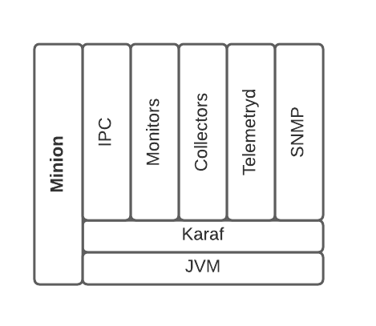

# OpenNMS 2.0

## Motivation

Let's reassess the architecture of the stack and the different runtimes with the aim of:
* Improving the developer experience
* Improving the resiliency and scalability of the platform (cloud-ready)
* Reducing technical debt associated with the diverse technologies and aged libraries

## Current state

There are currently 3 different runtimes in the stack:

**Core** is the original bootstrap that runs the majority of the services and business logic.

**Minion** acts as the "eyes and ears" on the remote networks and interacts with the elements.

**Sentinel** helps scale particular workloads from the core.

The Core is based on a custom bootstrap which uses Spring for the bulk of the wiring and embeds Jetty, Karaf and ActiveMQ.

The Minion and Sentinel are custom Karaf distributions.

### Core

### Minion

### Sentinel

See [SENTINEL](SENTINEL.md) for more information on the Sentinel runtime.

## Research

* Identify code formatting / linting tool [S]
* Approach to testing [L]
* Authentication subsystem design [M]
* Git repository layout [M]
* Determine which modules remain in the main source tree, which module we remove and which modules live on as a plugins [L]
* Design Karaf feature tree [L]
* Review configuration files and identify settings that fall into the different buckets [L]

## Recommendations

### Make formatting a non-issue

* Apply a code linting tool
* Enforce standards via CI
* Provide specifications for Intellij, VSCode & Eclipse

### Make modules easier to find

* Move non-core pieces out of the repository
* Re-design the Maven project structure
* Rewire everything using Blueprint or OSGi R7 annotations
* Review package names (will be required for OSGi support)

### Standardize on Karaf as a runtime

* Two different base Karaf distributions: Horizon & Minion
* Horizon: Combination of what we currently know as Core & Sentinel
* Minion: Status quo

#### Motivation

We want to standardize on using Karaf as the base distribution and move away from the custom bootstrap currently used by the Core.

This will allow us to take full advantage of the modularity of OSGi and the Karaf ecosystem.

This will also allow us to reduce technical debt and complexity of the current solution - there are may pain points associated with different forms of wiring and classloader issues related to running Karaf inside the Core.

### Leverage Karaf features for modularity

* Everyone uses OpenNMS differently - run the features that correspond to your workloads

### Rebuild our configuration model

* Separate "system configuration" vs "feature configuration" vs "network inventory & model"

#### System configuration

What:
 * Tuning
 * Feature flags
 * Ports
 * Cache sizes

How:
 * Exposed via confd

#### Feature configuration

What:
* What to monitor
* How to monitor it
* How frequently to collect data
* What to collect
* Business rules

How:
* REST API
* Pre-provisioned via files on disk

#### Network inventory & model

What:
* List of devices (i.e. requisitions)

How:
* REST API

### Rewrite the UI in Vue3 as an SPA

* Vue3 based SPA leveraging Feather DS: https://feather.nanthealth.com/

### Make containers first class citizens

Improve logging

Reduce container size

Easy metrics

### Rethink how we do testing

#### Current state

We're heavily tied to Spring

A lot of greybox testing makes refactoring difficult, update a lot of tests

#### Target state

Whitebox testing (unit, mocks, no DB access)

Blackbox testing (containers)

Limit greybox testing (replicating complex wiring of services in tests)

### Establish Horizon Technical Steering Committee

Establish group and regular communications that help align technical direction of the platform with the needs of our community, customers and business objectives.

## Expected outcomes

* A whole new OpenNMS development experience
* Significant changes to how we use OpenNMS and administrate OpenNMS
* Increase scale and resilience
* Increased effort in porting changes from previous branches forward (all the code will change)
* Increase in contributors and collaboration between contributors

## KPIs

* Build time (partial for PR, and full for release branch) (expect decrease)
* Startup time (expect decrease)
* # unique contributors, # PRs merged (expect increased velocity)

